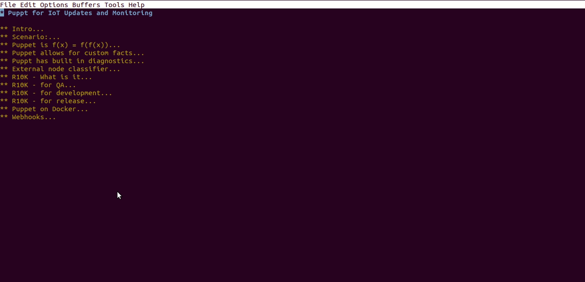

# Puppet Deployment for IoT Pop Machines

[Presentation](https://github.com/kirkins/puppet-pop-machine/blob/master/presentation.org) format is [emacs org-mode](http://orgmode.org/).

Presentation made with Emacs [Presentation-Outline-Mode](https://p4bl0.net/shebang/emacs-outline-presentation-mode.html)

To install with all sub-modules run:

    git clone --recurse-submodules git@github.com:kirkins/puppet-pop-machine.git

## puppet-docker-stack

Docker-Compose setup for Puppet, PuppetDb, and 2 GUI applications
for monitoring. 

## external-node-classifier

This script will be placed on the puppet server and determines
how nodes will be classified.

## control-repo

Each branch on this repo contains the code a specific configuration.

For example if we wanted to have seperate configurations for coke &
pepsi based pop machines, we would create a branch for each.

The external node classifier determines which branch to apply to a
node which is checking in.

## control-repo-globals

When making a branch for each configuration type in the control-repo
you often have configurations, modules, or files you want to be accessible by
all branches. To simplify the process we've placed these in a seperate
repo

## pop-machine-gui

This is a very simple GUI that will represent the pop machine. I will
have it running on a raspberry pi with touch screen. Inventory for each
pop type will be recorded each time a button is pressed.

The raspberry pi will be running puppet agent and check into the puppet
server on regular intervals. From the puppet server we will be able to
monitor revenue, inventory, and the gereral state of the linux system
running the machine.

The GUI will be used to demonstrate the switching of a machine from one
configuration group to another. For example serving a new mountain dew
type on a select group of machines.

### Note on webhooks

Another good addition to this setup is the use of adnanh/webhook
it's Go based executable that allows you to map endpoints on a port
to bash commands. 

You should have webhooks connecting control-repo and control-repo-globals
to the puppet server.

https://github.com/adnanh/webhook

I recommend the following hooks on this setup
_(trigger on left, puppet server command on left):_

- Control-Repo updated          -> `r10k deploy environment`
- Control-Repo Global updated   -> `cd /etc/puppetlabs/code && r10k puppetfile install`

## Chart of Puppet Docker Stack

         +------------+   +------------+
         | GUI        |   | GUI        |
         |            |   |            |
         +--------^---+   +---^--------+
                  |           |
                  |           |
                 ++-----------+--+      +-----------------+
                 | PuttetDb      |      | Puppet Server   |
                 |               |      |                 |
                 |               <------>                 |
                 |               |      |                 |
                 +-------^-------+      +-----------------+
                         |
                         |
                 +-------+-------+
                 | Postgres      |
                 |               |
                 +---------------+

## External node classifier (ENC)

     Configuration Files

     +--------------+   +---------------+  +----------------+
     | RC Cola      |   | Coke          |  | Coke beta #42  |
     |              |   |               |  |                |
     +-----------+--+   +-------+-------+  +--+-------------+
                 |              |             |
                 |              |             |
                 |              |             |
              +--+--------------+-------------+-+
              | External Node Classifie         |
              | (ENC)                           |
              |                                 |
              +--+---------+-----------+--------+
                 |         |           |        |
    Pop          |         |           |        |
    Machines     |         |           |        |
            +----+--+  +---+---+   +---+---+   ++------+
            |       |  |       |   |       |   |       |
            |       |  |       |   |       |   |       |
            |       |  |       |   |       |   |       |
            |       |  |       |   |       |   |       |
            |       |  |       |   |       |   |       |
            +-------+  +-------+   +-------+   +-------+

## R10K Chart

Tree of commits where each branch represents the state of configuration files.
On the puppet server running `R10K deploy environment` will populate `/etc/puppetlabs/code/environments`
the command should be run each time one of your branches is updated (see webhooks).:
                                                                                                                                                      
                   +----------+                                                                                                                   
                   | Prod.    |                                                                                                                   
                   |          |                                                                                                                   
                   |          |                                                                                                                   
                   |          |                                                                                                                   
                   +-+-------++                                                                                                                   
                     |       |                                                                                                                    
                     |       |                                                                                                                    
              +------+--+ +--+-------+                                                                                                            
              | Coke    | | RC Cola  |                                                                                                            
              |         | |          |                                                                                                            
              |         | |          |                                                                                                            
              |         | |          |                                                                                                            
              +--+------+ +----------+                                                                                                            
                 |                                                                                                                                
                 |                                                                                                                                
         +-------+--+                                                                                                                             
         | Coke-FR  |                                                                                                                             
         |          |                                                                                                                             
         |          |                                                                                                                             
         |          |                                                                                                                             
         +--+-------+                                                                                                                             
            |                                                                                                                                     
            |                                                                                                                                     
    +-------+--+                                                                                                                                  
    | Coke-FR  |                                                                                                                                  
    | Beta #42 |                                                                                                                                  
    |          |                                                                                                                                  
    |          |                                                                                                                                  
    +----------+                                                                                                                                  
                                                              

## R10K file structure

    /etc/puppetlabs/code
    |── Puppetfile
    |── local_modules
    |   |── custom_facts
    |   |── custom_files
    |
    |── environments
        |── Coke
        |   |── manifests
        |       |── packages.pp
        |
        |── RC Cola
        |   |── manifests
        |       |── packages.pp
        |
        |── Coke FR
        |   |── manifests
        |       |── packages.pp
        |
        |── Coke FR #42
            |── manifests
                |── packages.pp
